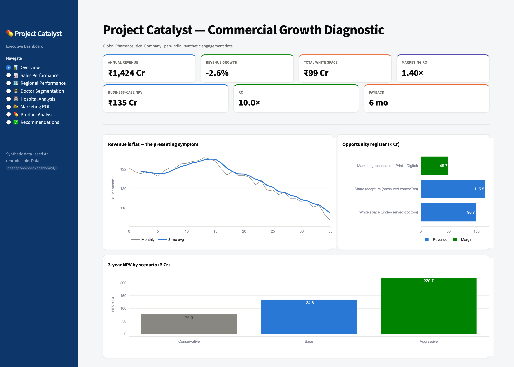
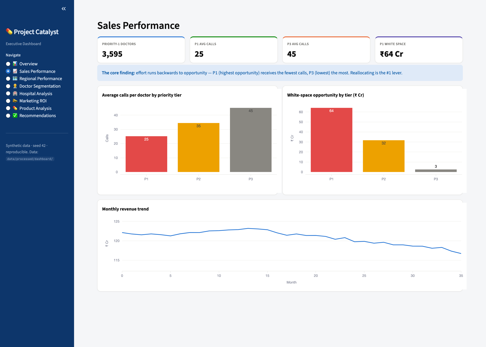
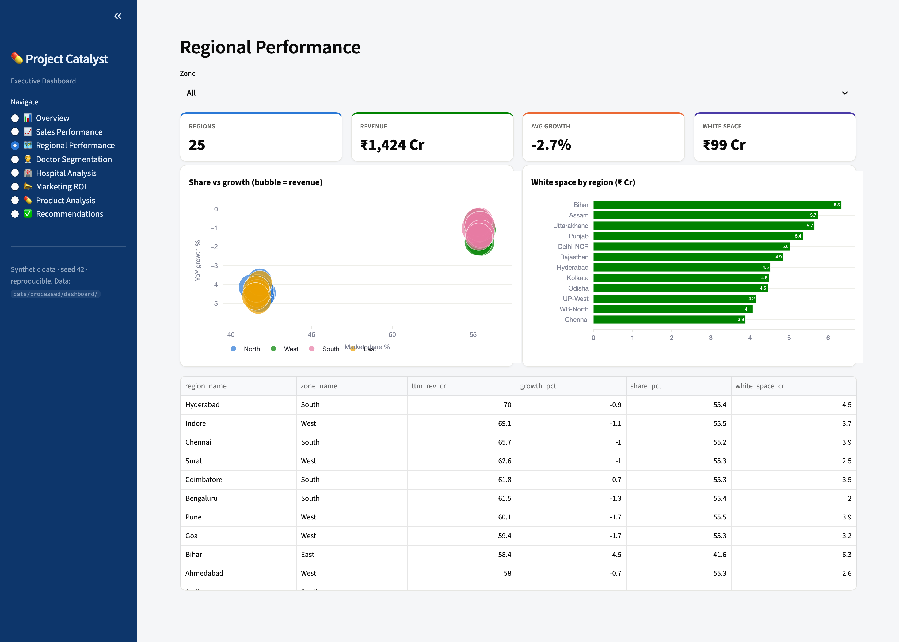

# Pharma Sales & Incentive Analytics

**A student data engineering project building a Python ETL pipeline to generate and load synthetic pharmaceutical data into a PostgreSQL database, visualized using Power BI and Streamlit.**

---

## Overview

This project builds a robust data engineering and analytics pipeline for a simulated pharmaceutical company. It handles the generation, validation, and loading of commercial data (sales reps, doctors, prescriptions, and marketing activity) into a structured dimensional data model to support business intelligence and reporting.

**Core Features:**
- Python-based ETL pipeline generating ~500,000 rows of relational data.
- Automated data cleaning, validation, and quality reporting.
- PostgreSQL dimensional data model (star schema) with views and custom SQL stored procedures (including incentive calculations).
- Interactive Streamlit dashboard for business insights and exploratory data analysis.
- End-to-end automation via Makefile.

---

## 📊 Executive Dashboard

A Streamlit dashboard that provides insights into regional performance, sales, and marketing activity.



<table>
  <tr>
    <td width="50%"></td>
    <td width="50%"></td>
  </tr>
</table>

---

## Architecture

```text
Presentation  │ Streamlit dashboard · Power BI
Analytics     │ Exploratory Data Analysis · Data Quality Checks
Storage       │ PostgreSQL (catalyst schema) · Dimensional model · Views · Stored procedures
Foundation    │ Python ETL pipeline (~500,000 rows) · Data validation
```

---

## Technology Stack

| Layer | Technologies |
|-------|-------------|
| Core | Python 3.9+, Pandas |
| Database | PostgreSQL 15 (Docker), SQLAlchemy |
| Visualization | Matplotlib, Seaborn |
| Dashboard | Streamlit, Power BI |
| Infrastructure | Docker Compose, Makefile |

---

## Repository Structure

```text
config/       Pipeline configuration (engagement_config.yaml)
data/         raw · processed
docs/         architecture · data model · data dictionary
sql/          schema · views · procedures
src/catalyst/ data_generation · pipeline · utils
dashboard/    powerbi · streamlit
reports/      data-quality report · eda_report
scripts/      build & pipeline entry points
```

---

## Pipeline Stages

| Stage | Command | What it does |
|-------|---------|-------------|
| 1. Generate | `make generate` | Synthetic data engine → CSVs in `data/raw/` |
| 2. Validate | `make validate` | Clean → validate → data quality report |
| 3. DB Load | `make db-load` | PostgreSQL schema, bulk load, views, stored procedures |
| 4. EDA | `make eda` | Exploratory data analysis |
| 5. Dashboard | `make dashboard` | Launch Streamlit app |

---

## Quickstart

```bash
make setup                 # create venv + install dependencies
make build                 # generate synthetic data + validate + DQ report
make db-up                 # start PostgreSQL (Docker)
make db-load               # create schema, bulk-load, build views & stored procedures
make dashboard             # launch the Streamlit dashboard

# explore the SQL semantic layer
docker exec catalyst_pg psql -U catalyst -d catalyst \
  -c "SELECT * FROM catalyst.rep_incentives_summary;"
```

## Documentation

| Document | Description |
|----------|-------------|
| [Solution Architecture](docs/03_solution_architecture.md) | Layered architecture and tech stack |
| [Data Model & ERD](docs/04_data_model_and_erd.md) | Dimensional model, ER diagram |
| [Data Dictionary](docs/05_data_dictionary.md) | Table and column definitions |
| [Data Quality Report](reports/data_quality_report.md) | Validation of structural integrity |

<sub>All data is synthetic and privacy-safe.</sub>
