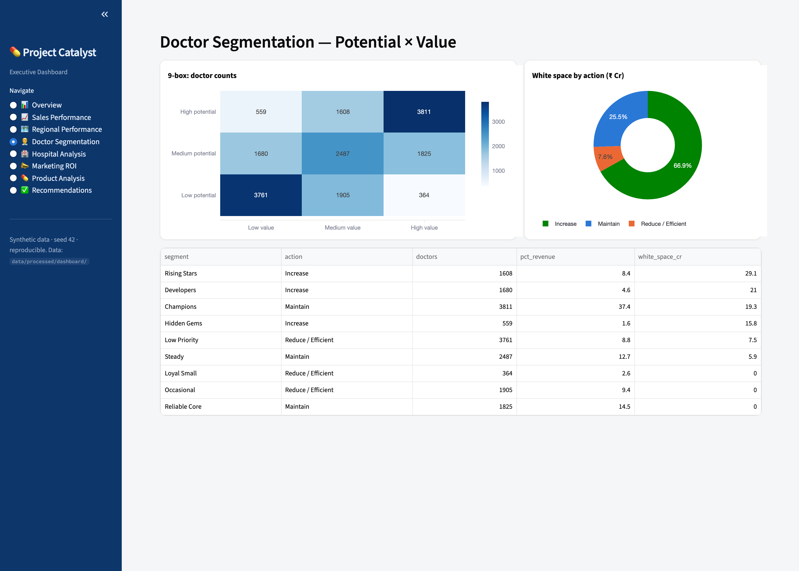
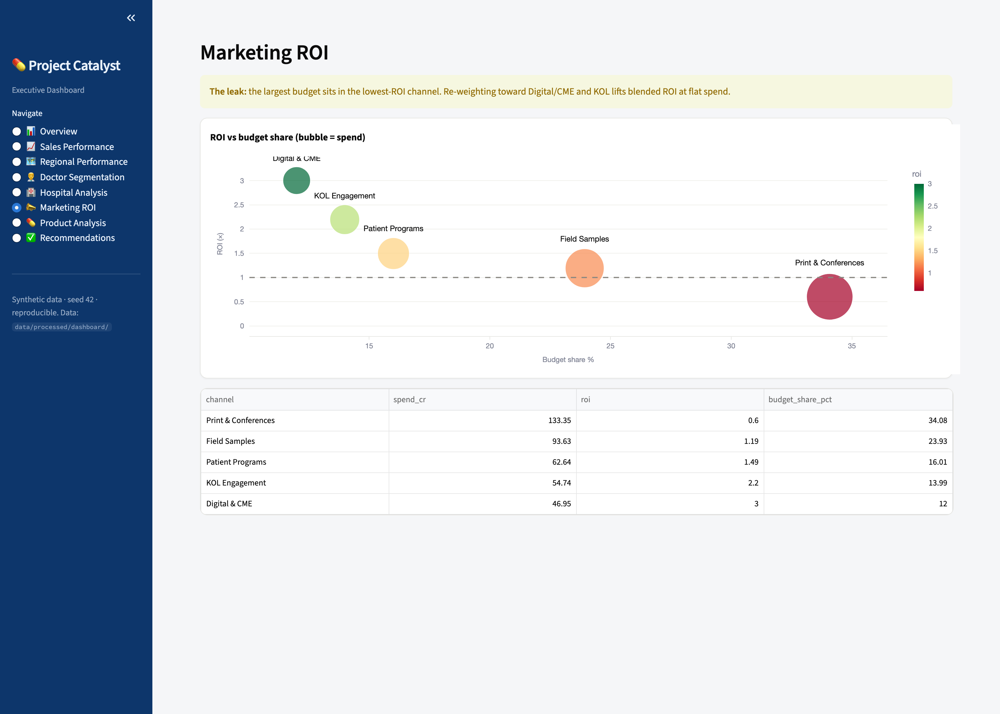
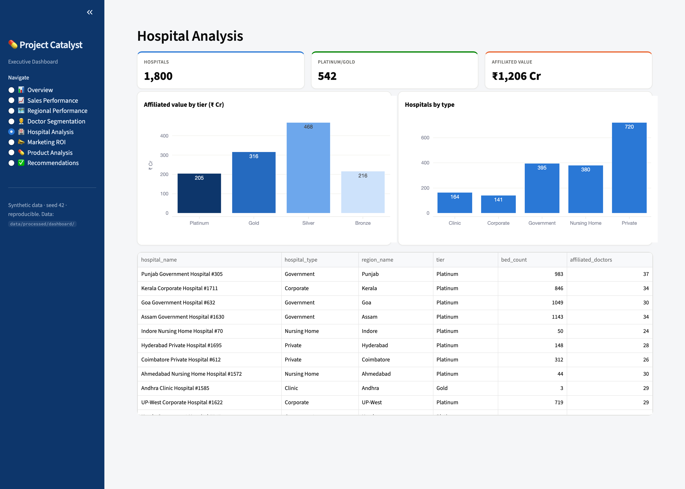
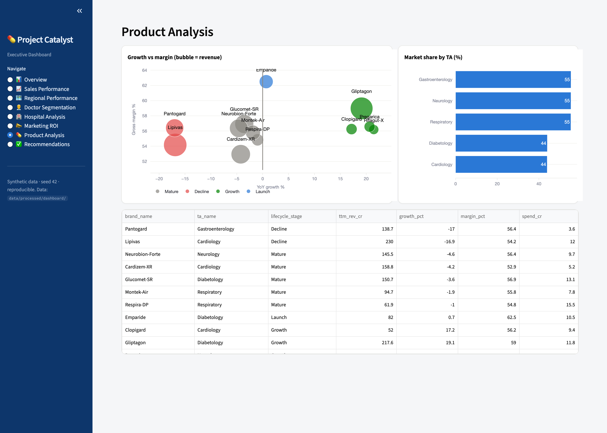

<h1 align="center">Pharma Commercial Analytics Platform</h1>
<p align="center"><b>End-to-end data analytics pipeline for a simulated pharmaceutical company</b></p>

<p align="center">


</p>

---

## Overview

This project builds a **complete commercial analytics platform** for a simulated pharmaceutical company operating across India — 50 sales reps, 5 regions, 1,500 doctors, 150 hospitals, and 5 product brands across 2 therapeutic areas (Cardiology & Diabetology).

The platform diagnoses why the company has **stagnant revenue despite rising promotional spend**, and produces a data-driven reallocation strategy to capture growth at flat cost.

> **The core question:** *Where is the growth hiding, and how do we redirect finite selling and marketing capacity to capture it — without increasing total cost?*

**What I built:**
- Synthetic data engine generating ~500,000 rows with embedded business patterns
- Full ETL pipeline: generation → cleaning → validation → PostgreSQL load
- Dimensional data model (star schema) with SQL KPI library
- Doctor segmentation (Potential × Value 9-box) and hospital tiering
- Prescription, regional, product, and marketing performance diagnostics
- Revenue forecasting (ETS model + intervention overlay)
- Commercial Opportunity Score — a transparent 0-100 doctor prioritisation index
- Territory optimization and capacity-neutral call reallocation
- 7-page interactive Streamlit executive dashboard
- Automated end-to-end via Makefile with pytest tests

---

## 📊 Executive Dashboard

A 7-page **Streamlit** dashboard that reads precomputed aggregates — launches in seconds with **no database** required (`make dashboard`).


<table>
  <tr>
    <td width="50%"></td>
    <td width="50%"></td>
  </tr>
  <tr>
    <td width="50%"></td>
    <td width="50%"></td>
  </tr>
</table>

<details>
<summary><b>More pages</b> — Hospital, Product</summary>




</details>

---

## 🔍 Key Analytical Outputs

| Effort runs **backwards** to opportunity | **Capacity-neutral** call reallocation |
|:---:|:---:|
|  |  |

---

## Architecture

```
Presentation  │ Streamlit dashboard (7 pages) · Power BI spec · Reports
Decision      │ Opportunity scoring · Territory optimization
Analytics     │ EDA · Segmentation · Rx opportunity · Performance · Marketing mix · Forecasting
Storage       │ PostgreSQL (catalyst schema) · Dimensional model · Views · Stored procedures
Foundation    │ Synthetic data engine (~500,000 rows) · ETL pipeline · Data quality validation
                                  ▲ config/engagement_config.yaml drives every layer
```

---

## Technology Stack

| Layer | Technologies |
|-------|-------------|
| Core | Python 3.9+, NumPy, Pandas, PyYAML |
| Database | PostgreSQL 15 (Docker), SQLAlchemy, psycopg2 |
| Analytics | scikit-learn, statsmodels, scipy |
| Visualization | Matplotlib, Seaborn, Plotly |
| Dashboard | Streamlit |
| Testing | pytest |
| Infrastructure | Docker Compose, Makefile |

---

## Repository Structure

```
config/       engagement_config.yaml (single source of truth)
data/         raw · processed · external
docs/         KPI framework · architecture · data model · data dictionary
sql/          schema · views · procedures · analysis (business query library)
src/catalyst/ data_generation · pipeline · analytics · segmentation · forecasting ·
              scoring · optimization · visualization · utils
dashboard/    powerbi (specs+DAX) · streamlit (runnable dashboard)
notebooks/    EDA diagnostic notebook
reports/      analytics reports · data-quality report · figures
tests/        pytest suite
scripts/      build & pipeline entry points
```

---

## Pipeline Stages

| Stage | Command | What it does |
|-------|---------|-------------|
| 1. Generate | `make generate` | Synthetic data engine → 16 CSVs, ~500k rows in `data/raw/` |
| 2. Validate | `make validate` | Clean → validate → data quality report in `data/processed/` |
| 3. DB Load | `make db-load` | PostgreSQL schema, bulk COPY, indexes, views, stored procedures |
| 4. EDA | `make eda` | Diagnostic EDA report + charts |
| 5. Segment | `make segment` | Doctor 9-box + hospital tiers + playbooks |
| 6. Performance | `make performance` | Rx/region/product/marketing diagnostics + opportunity register |
| 7. Forecast & Score | `make score` | ETS forecast + Commercial Opportunity Score (0-100) |
| 8. Optimize | `make optimize` | Territory call reallocation + rep deployment plan |
| 9. Dashboard | `make dashboard` | Precompute aggregates + launch Streamlit app |

---

## Quickstart

```bash
make setup                 # create venv + install dependencies
make build                 # generate synthetic data + validate + DQ report
make db-up                 # start PostgreSQL (Docker)
make db-load               # create schema, bulk-load, build views & stored procedures
make test                  # run the test suite
make dashboard             # launch the 7-page Streamlit executive dashboard

# explore the SQL semantic layer
docker exec catalyst_pg psql -U catalyst -d catalyst \
  -c "SELECT * FROM catalyst.fn_top_doctors(NULL, 10);"
```

Reproducible end-to-end from `config/engagement_config.yaml` (seed = 42).

## Documentation

| Document | Description |
|----------|-------------|
| [KPI Framework](docs/02_kpi_framework.md) | Metric tree, KPI catalogue with formulas |
| [Solution Architecture](docs/03_solution_architecture.md) | Layered architecture, tech stack, ADRs |
| [Data Model & ERD](docs/04_data_model_and_erd.md) | Dimensional model, ER diagram, grain, keys |
| [Data Dictionary](docs/05_data_dictionary.md) | Every table/column, types, business meaning |
| [Data Quality Report](reports/data_quality_report.md) | Validation of structural integrity and business plausibility |

<sub>All data is synthetic and privacy-safe.</sub>
"# Pharma-Commercial-Analytics-Platform" 
"# Pharma-Commercial-Analytics-Platform" 
