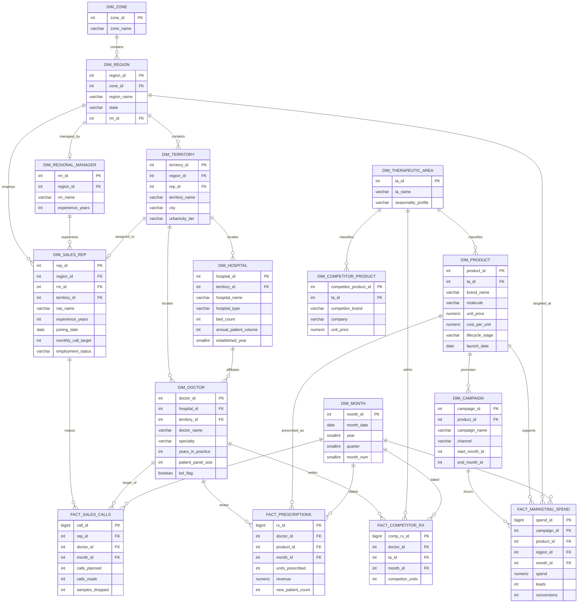

# Project Catalyst — Data Model & ER Diagram

**Status:** Milestone 1 baseline · **Engine:** PostgreSQL · **Schema:** `catalyst`
**Pattern:** Dimensional (star/snowflake) model optimised for commercial analytics.

---

## 1. Modelling approach

We model the commercial world as a **dimensional model**: descriptive *dimensions* (who/what/where) surround measurable *facts* (how much/how many). This is the right pattern for an analytics + BI workload — it makes KPIs, ranking, and Power BI relationships natural, and avoids the join sprawl of a normalised OLTP schema (ADR-4).

**Grain is the first design decision.** We fix it explicitly for each fact:

| Fact | Grain (one row per…) |
|------|----------------------|
| `fact_prescriptions` | doctor × product × month |
| `fact_competitor_rx` | doctor × therapeutic_area × month |
| `fact_sales_calls` | rep × doctor × month |
| `fact_marketing_spend` | campaign × region × month |

**Design decisions worth noting for review:**
- **Derived scores are not stored as raw source data.** Potential / influence / opportunity scores are *outputs* of the analytics layer, materialised into views/tables downstream (Milestones 4–6), not planted as columns in `dim_doctor`. `dim_doctor` holds only the *drivers* (panel size, specialty, hospital tier) from which scores are computed. This keeps source and model cleanly separated.
- **Light snowflaking** on geography (`zone → region → territory`) and therapeutic area, because these hierarchies are reused across many facts and drive roll-ups.
- **Denormalised `territory_id` on doctor and hospital** for query convenience (avoids a 3-hop join on the hottest path), accepting the small redundancy — a standard analytics trade-off.

---

## 2. Entity-relationship diagram

---

## 3. Cardinality summary

| Relationship | Cardinality | Note |
|--------------|-------------|------|
| Zone → Region | 1 : many | 2 zones, 5 regions |
| Region → Territory | 1 : many | 10 territories per region |
| Region → Regional Manager | 1 : 1 | 5 RMs |
| Territory → Sales Rep | 1 : 1 | 50 reps ↔ 50 territories (UNIQUE) |
| Territory → Doctor | 1 : many | ~30 doctors per territory |
| Territory → Hospital | 1 : many | ~3 hospitals per territory |
| Hospital → Doctor | 1 : many | a doctor has one primary affiliation |
| Therapeutic Area → Product | 1 : many | 2 TAs, 5 products |
| Product → Campaign | 1 : many | campaigns promote one product |
| Doctor × Product × Month → Prescriptions | fact | core commercial fact |

---

## 4. Referential integrity & keys

- **Primary keys:** surrogate integer keys on all dimensions; `BIGSERIAL` on facts.
- **Foreign keys:** every fact FK references its dimension PK; ON DELETE RESTRICT (data is analytical, not transactional — we never cascade-delete history).
- **Natural/business keys:** e.g. `month_id` = `YYYYMM` integer (human-readable, sortable, join-friendly).
- **Unique constraints:** `dim_sales_rep.territory_id` UNIQUE (one rep per territory); composite uniqueness on facts at their declared grain to prevent duplicate loads.
- **Check constraints:** non-negative units/spend; `calls_made <= calls_planned * tolerance`; valid enum values (lifecycle_stage, hospital_type, channel).

Full DDL: `sql/schema/01_create_tables.sql`; indexes and constraints: `sql/schema/02_indexes_constraints.sql`.

---

## 5. Volume estimate (for indexing/perf planning)

| Table | Approx. rows | Basis |
|-------|-------------|-------|
| dim_doctor | 1,500 | brief |
| dim_hospital | 150 | brief |
| dim_sales_rep | 50 | brief |
| fact_prescriptions | ~200 K | 1.5k doctors × ~2 products each × 36 months |
| fact_sales_calls | ~180 K | reps call a subset of doctors × 36 months |
| fact_marketing_spend | ~10k | campaigns × regions × months |
| fact_competitor_rx | ~100 K | doctors × relevant TAs × 36 months |

Facts are indexed on `month_id`, the FK columns, and the hot composite `(doctor_id, month_id)` — see indexes DDL.
