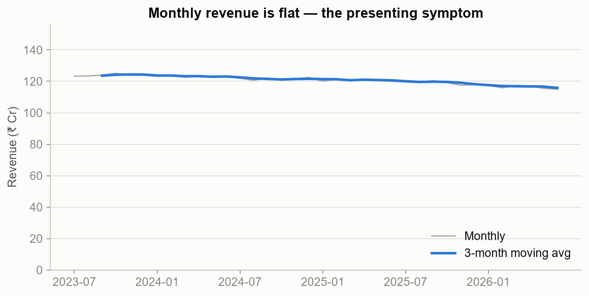
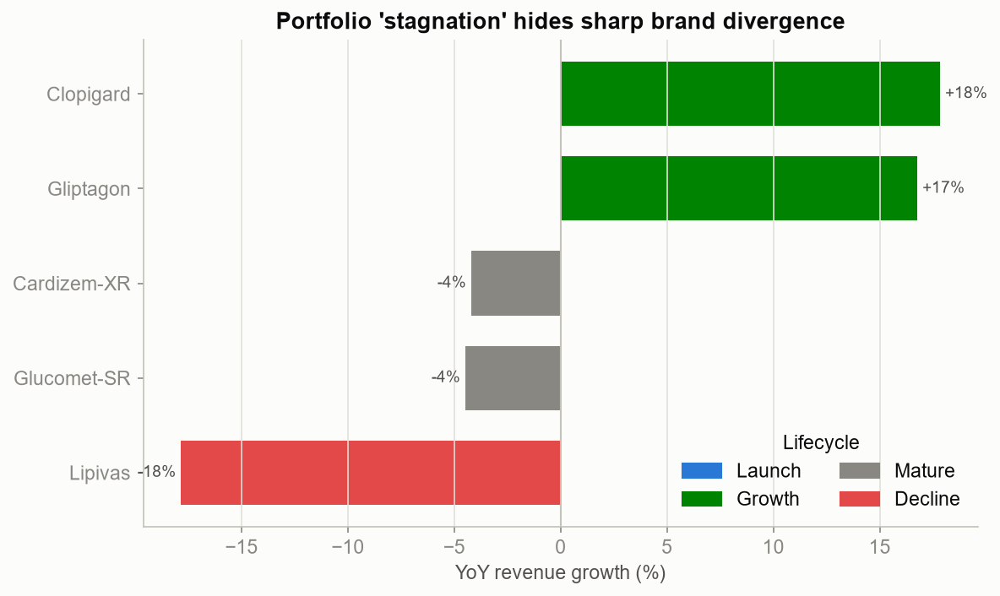
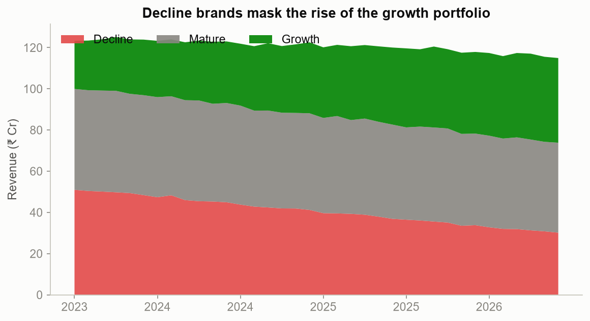
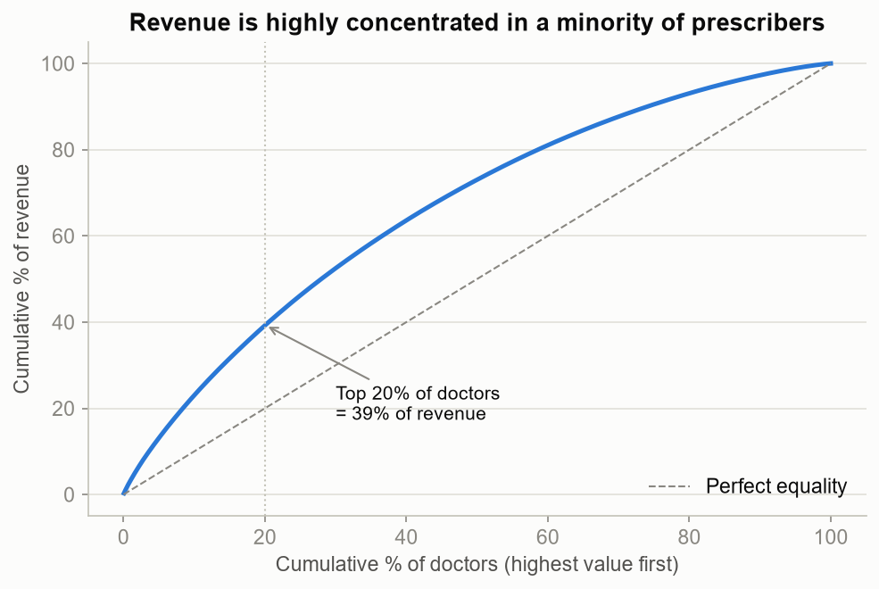
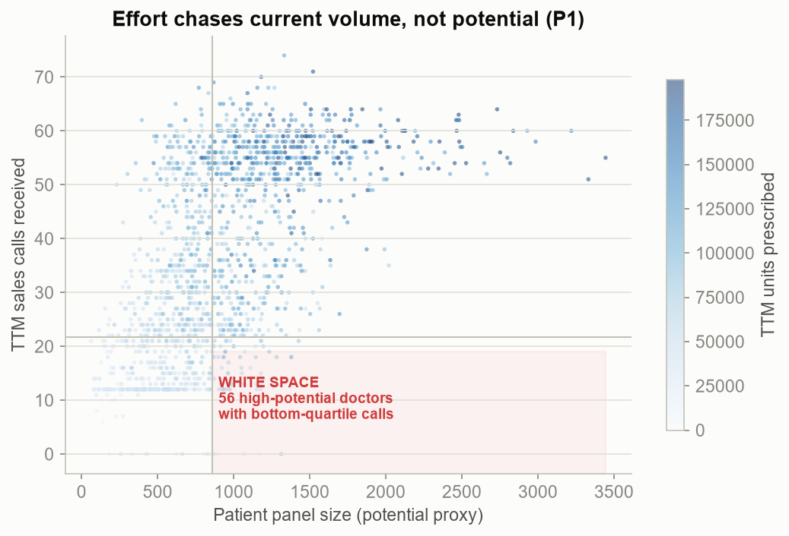
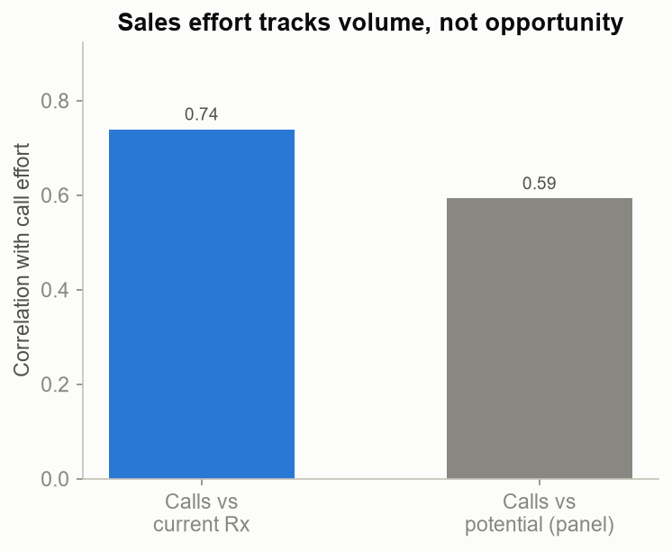
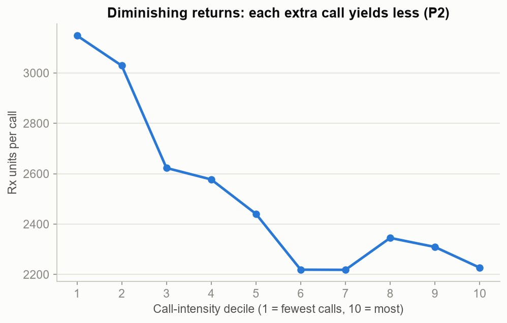
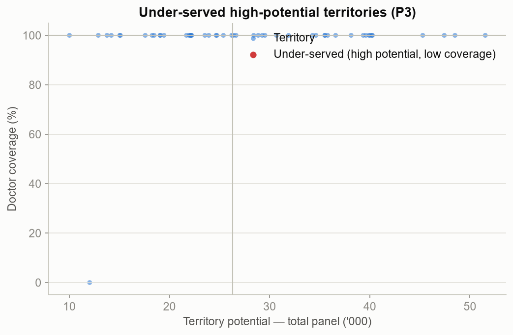
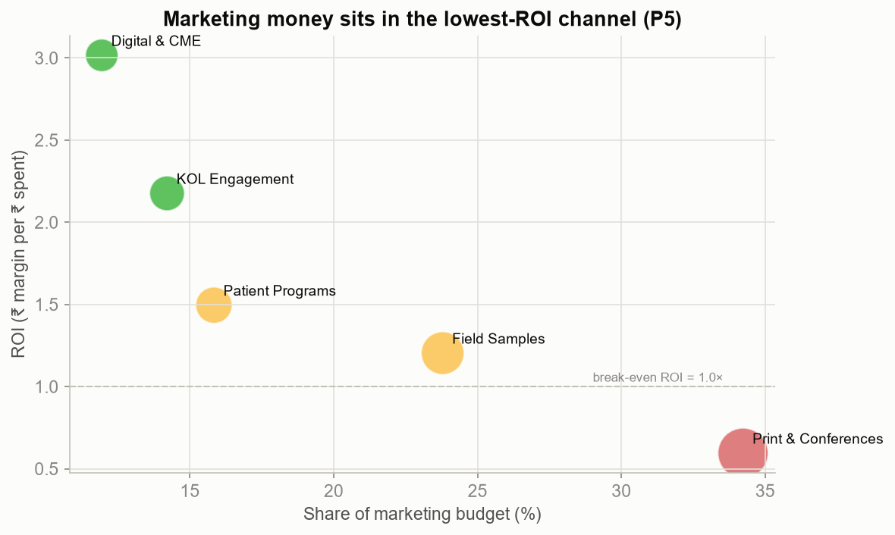
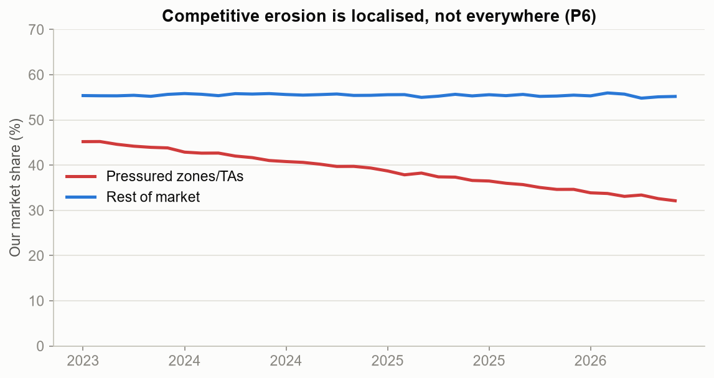

# Project Catalyst — Diagnostic EDA

**Reproducible report** · seed=42 · horizon 2023-07→2026-06 · all figures regenerated by `scripts/run_eda.py`.

> **The question:** the client spends more to grow less. This EDA locates *where* the growth is hiding and *why* effort and money are not converting — recovering, from raw data, the six commercial truths that frame the engagement.

## Headline

| KPI | Value |
|-----|------:|
| Annual revenue (TTM) | ₹ 1,412 Cr |
| Revenue growth (YoY) | -2.9% |
| Top-20% doctor revenue concentration | 39% |
| Blended marketing ROI | 1.40× |
| Under-served high-potential territories | 0 |

---

## 1. The symptom: flat revenue

Revenue is essentially flat at **-2.9% YoY**. This is not a demand story — the market is growing — so the problem is where effort and money land. The rest of this report decomposes that.

## 2. The paradox: stagnation hides divergence (P4)

The flat total is an *average of opposites*: **Lipivas** is down **-18%** while **Clopigard** is up **+18%**. Declining mature brands are masking a healthy growth portfolio. **Implication:** promotional support is likely mis-weighted toward the wrong end of the lifecycle.

## 3. Customers are concentrated

The top **20%** of doctors account for **39%** of revenue. Targeting must be differentiated — but concentration alone doesn't tell us *who is under-served*. That is the next, decisive chart.

## 4. The smoking gun: effort chases volume, not potential (P1)

  

Call effort correlates **0.74** with a doctor's *current* prescribing but only **0.59** with their *potential* (panel size). The consequence is the shaded quadrant: **56 high-potential doctors** (7% of all high-potential prescribers) receive bottom-quartile call effort. **This is the white space** — the reallocation prize the engagement will size in rupees.

## 5. And the doctors we over-call are saturating (P2)

Rx-per-call falls from **2933** at low call-intensity to **2294** at high intensity — classic diminishing returns. Effort poured onto already-loyal, high-decile doctors earns a low marginal return, while the white-space doctors above go under-served.

## 6. Some territories are structurally under-resourced (P3)

**0 territories** combine top-half potential with bottom-quartile coverage (avg coverage nan%). These are candidates for re-alignment and new-rep deployment (Milestone 7).

## 7. Marketing money is in the wrong channel (P5)

Blended ROI is just **1.40×**. **Print & Conferences** absorbs **34%** of budget at **0.59×** ROI, while **Digital & CME** — at **3.02×** — receives only **12%**. Re-weighting spend toward high-ROI channels is a near-free lever.

## 8. Competitive loss is localised, not universal (P6)

Share in the pressured zones/TAs fell from **44% → 33%**, while the rest of the market held steady (**55% → 55%**). The competitive fix should be *targeted*, not a blanket national response.

---

## So what — the diagnostic thesis

1. **Reallocate field effort** from saturated high-deciles toward the 56-doctor white space and the 0 under-served territories.
2. **Re-weight marketing** from Print toward Digital/CME to lift blended ROI above 1.40×.
3. **Rebalance promotional mix** toward growth brands; manage the declining hero for cash.
4. **Defend selectively** in the pressured zones rather than spreading thin.

Milestones 4–8 quantify each of these in rupees (segmentation → opportunity scoring → optimization → financial model).
