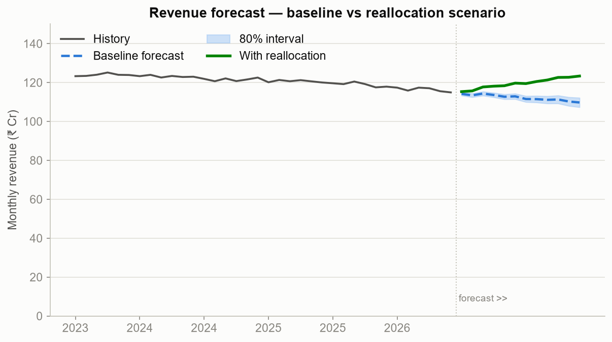
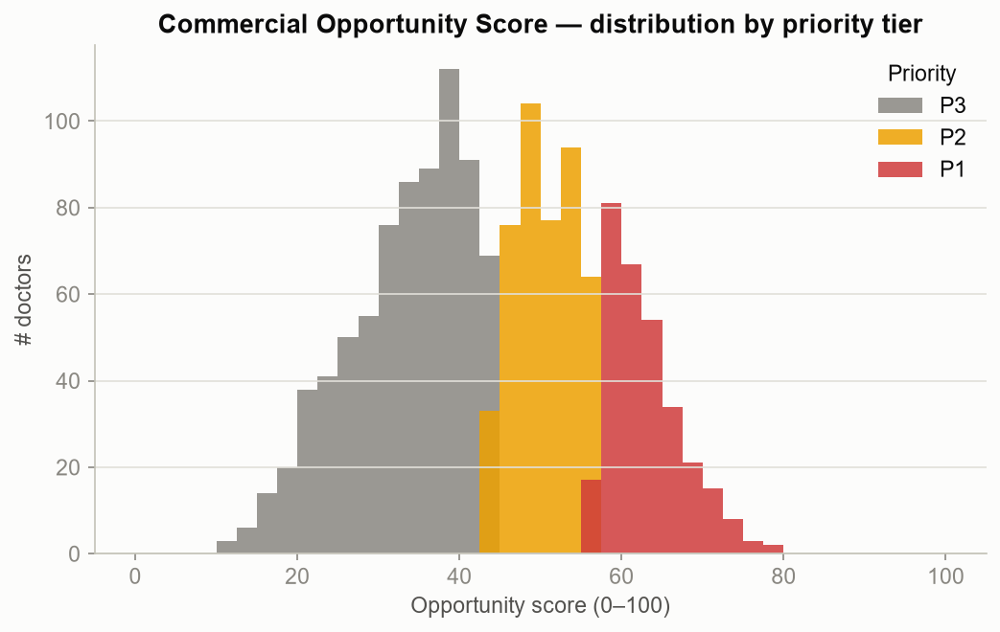
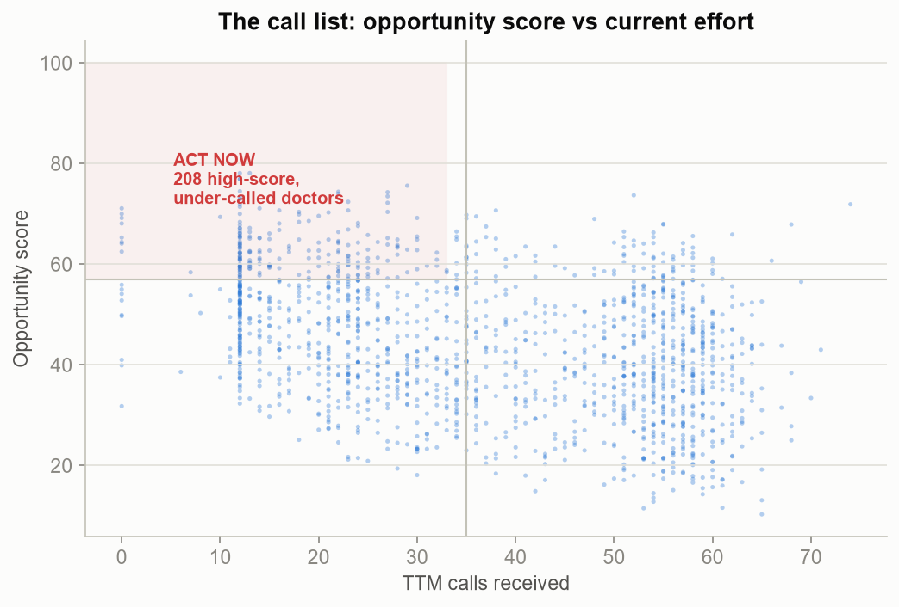
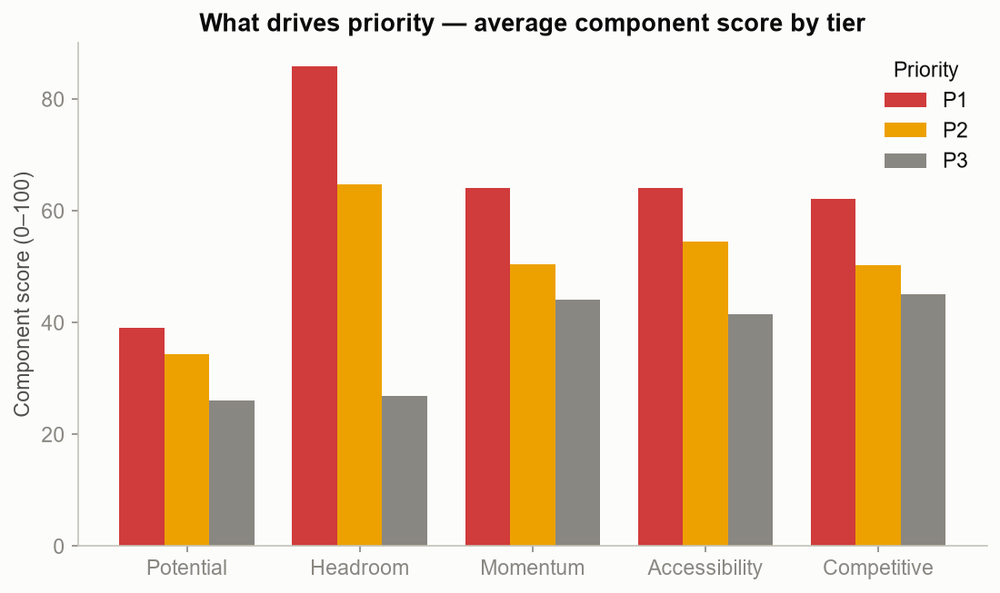

# Pharma Commercial Analytics Platform — Forecasting & Commercial Opportunity Scoring

**Reproducible** · seed=42 · `scripts/run_forecast_scoring.py`.

Two deliverables: a **board-grade revenue forecast** (what happens if we act vs not)
and the **Commercial Opportunity Score** — the single ranked call list for the field.

---

## 1. Revenue forecast (Module 13)

An ETS model (additive trend + seasonality) gives the **baseline**; the **driver overlay**
phases in a conservative 50% capture of the ₹326 Cr
revenue opportunity register (M5) over 12 months.

| Scenario | Year-1 revenue | vs baseline |
|----------|---------------:|------------:|
| Baseline (do nothing) | ₹1,347 Cr | — |
| With reallocation | ₹1,435 Cr | **+₹88 Cr (+6.6%)** |
| Exit run-rate (annualised) | ₹1,480 Cr | — |

The baseline confirms the client's problem — flat. The gap between the two lines is the
value of acting, and it compounds into the exit run-rate the financial model (M8) carries forward.

---

## 2. Commercial Opportunity Score (Module 14)

The master field-prioritisation index — a transparent 0–100 composite, published weights,
fully explainable to a sales VP:

> **Weights:** Potential 30% · Headroom 30% · Momentum 15% · Accessibility 15% · Competitive 10%

**302 doctors are Priority-1.** The decisive picture is the call-list scatter: **208
high-score doctors currently receive below-median call effort** — the field's immediate
"act now" list. The component chart shows P1 doctors are driven by high potential + headroom +
accessibility — exactly the reallocation thesis, now operationalised per doctor.

### Top-15 priority doctors

| Score | Doctor | Region | Segment | TTM Rev | TTM Calls | White space |
|------:|--------|--------|---------|--------:|----------:|------------:|
| 78 | 386 | Delhi-NCR | Hidden Gems | ₹22.7L | 13 | ₹51.3L |
| 78 | 1115 | UP-West | Rising Stars | ₹64.4L | 12 | ₹36.6L |
| 76 | 1488 | Delhi-NCR | Developers | ₹35.9L | 12 | ₹22.5L |
| 76 | 480 | UP-East | Developers | ₹30.8L | 12 | ₹22.3L |
| 75 | 1296 | Delhi-NCR | Rising Stars | ₹68.5L | 29 | ₹43.2L |
| 74 | 481 | Delhi-NCR | Developers | ₹22.6L | 12 | ₹29.2L |
| 74 | 776 | Delhi-NCR | Hidden Gems | ₹45.8L | 22 | ₹40.0L |
| 74 | 1200 | Delhi-NCR | Rising Stars | ₹80.8L | 27 | ₹26.6L |
| 74 | 720 | UP-West | Rising Stars | ₹74.1L | 22 | ₹34.9L |
| 73 | 397 | UP-West | Champions | ₹118.0L | 52 | ₹41.7L |
| 73 | 943 | UP-West | Rising Stars | ₹80.8L | 27 | ₹40.5L |
| 73 | 474 | Delhi-NCR | Developers | ₹18.2L | 12 | ₹29.2L |
| 72 | 830 | Delhi-NCR | Developers | ₹36.2L | 12 | ₹26.1L |
| 72 | 107 | UP-West | Rising Stars | ₹70.6L | 23 | ₹24.7L |
| 72 | 575 | UP-West | Hidden Gems | ₹59.2L | 27 | ₹74.6L |

---

## So what → optimisation & financials

The score turns strategy into a **ranked list a rep can work Monday morning**. Milestone 7
uses the territory-level scores to re-balance workload and deploy new reps; Milestone 8
converts the forecast gap and capture ramp into ROI, NPV, payback, and scenario ranges.
