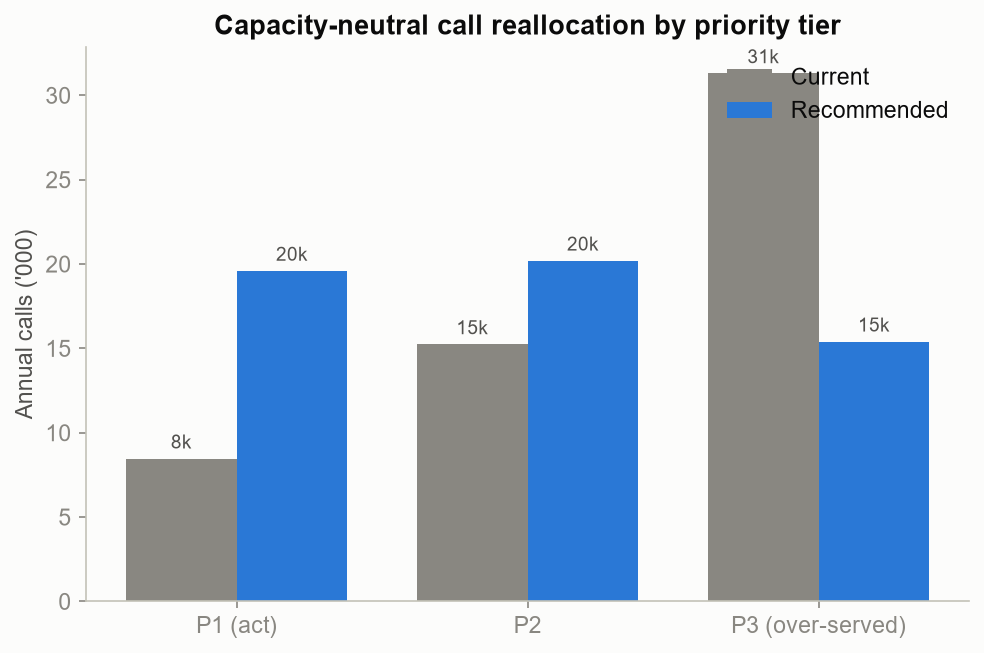
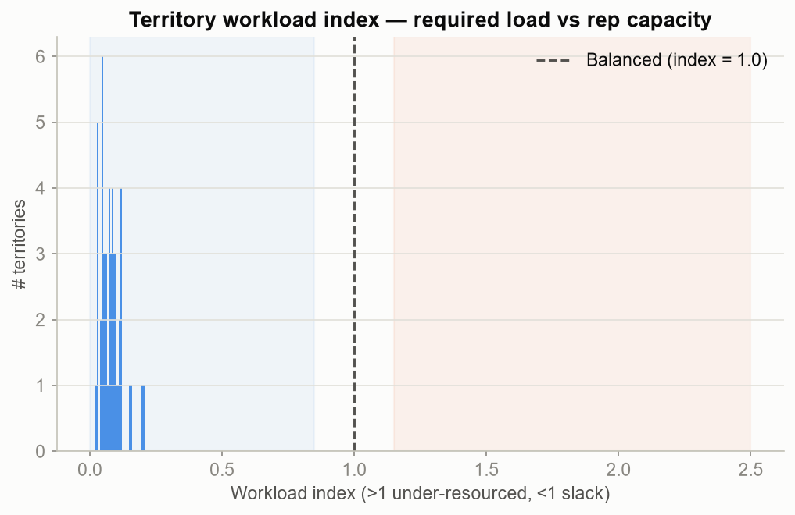
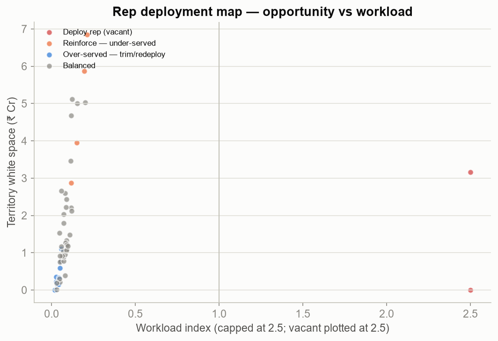
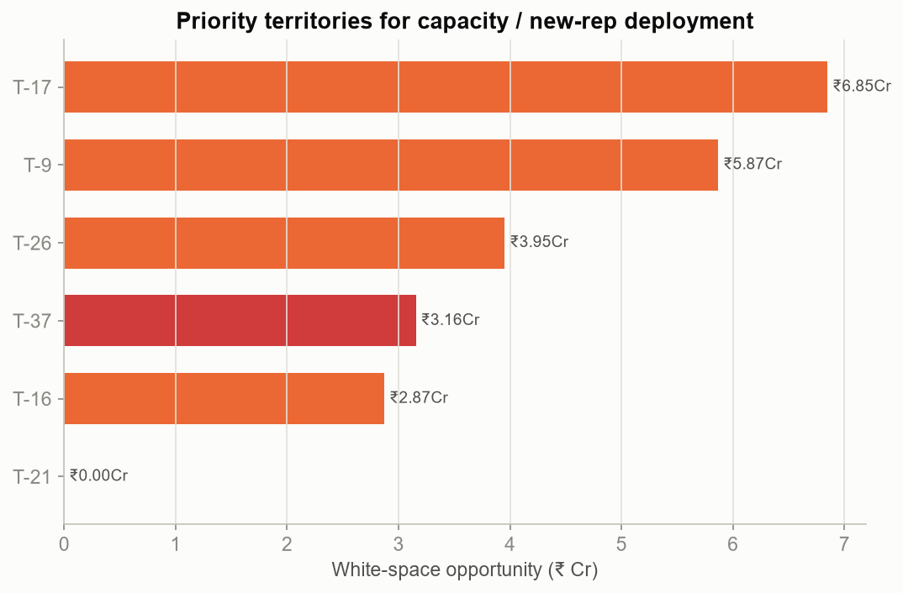

# Project Catalyst — Territory & Sales-Force Optimization

**Reproducible** · seed=42 · `scripts/run_optimization.py`.

Turns the Commercial Opportunity Score into a **field plan**: who gets more calls, who
gets fewer, which territories need capacity, and where new reps deploy — using
workload-balancing against opportunity (interpretable, not a solver black box).

## Headline

| Metric | Value |
|--------|------:|
| Calls reallocated (capacity-neutral) | 19,607 (36% of effort) |
| Vacant territories to fill | 2 |
| Under-served territories to reinforce (via reallocation, no new cost) | 4 |
| Over-served territories to trim/redeploy | 9 |
| **New reps needed (fill budgeted vacancies)** | **2** |
| White space behind deployment + reinforcement | ₹23 Cr |

---

## 1. Reallocate effort within each rep — at flat cost (Module 9)

Holding every rep's total calls constant, we re-split their capacity by opportunity
(ideal cadence: P1 = 18/yr · P2 = 9/yr · P3 = 3/yr). **19,607 calls (36% of all effort)** move
from over-served P3 doctors to under-served P1 white space — **no added cost**. This is the
single largest, lowest-risk lever in the engagement.

## 2. Capacity is ample — the constraint is allocation, not headcount (Module 9)

The workload index (required opportunity load ÷ rep capacity) sits **below 1.0 for almost every
territory** — reps have the capacity to hit the ideal cadence; they are simply pointed at the wrong
doctors. **The headline is therefore "reallocate, don't hire"** — the 36% call shift
above is nearly free. Reach is already saturated (avg coverage **100%**), so deployment
is driven by *call-frequency gaps and vacancies*, not by adding raw capacity everywhere.

## 3. Where to deploy reps (Module 15)

The deployment answer is deliberately lean: only **2 new reps** — to fill the
**2 budgeted vacant territories** that today have *zero* coverage. The other
**4 under-served high-opportunity territories** (low call frequency) are fixed by their
*existing* rep re-prioritising via the reallocation above — **no added headcount**. Together, the
deployment + reinforcement addresses **₹23 Cr** of white space; the financial
model (M8) prices the 2 vacancy fills against that capture.

### Priority territories to deploy / reinforce
| Territory | Region | Action | Calls/doc | P1 docs | White space |
|-----------|--------|--------|----------:|--------:|------------:|
| T-37 | Bengaluru | Deploy rep (vacant) | 0.0 | 8 | ₹3.16Cr |
| T-21 | Bengaluru | Deploy rep (vacant) | 36.0 | 0 | ₹0.00Cr |

### Over-served territories (trim & redeploy effort)
| Territory | Region | Calls/doc | P1 docs | White space |
|-----------|--------|----------:|--------:|------------:|
| T-3 | Chennai | 48.6 | 0 | ₹0.00Cr |
| T-18 | UP-East | 47.4 | 1 | ₹0.59Cr |
| T-10 | UP-West | 45.3 | 0 | ₹0.23Cr |
| T-12 | Chennai | 44.8 | 2 | ₹0.75Cr |
| T-19 | Chennai | 44.2 | 0 | ₹0.35Cr |
| T-2 | UP-East | 44.2 | 0 | ₹0.15Cr |

---

## So what → the financial model

Two funding-distinct moves: a **cost-neutral reallocation** (36% of effort, immediate,
~zero cost, addressing the reinforcement gaps) and a **minimal deployment** (2 reps to fill
budgeted vacancies). Milestone 8 prices both: rep cost, phased revenue capture, ROI, NPV, payback,
and sensitivity — against the ₹23 Cr the deployment + reinforcement unlocks.
