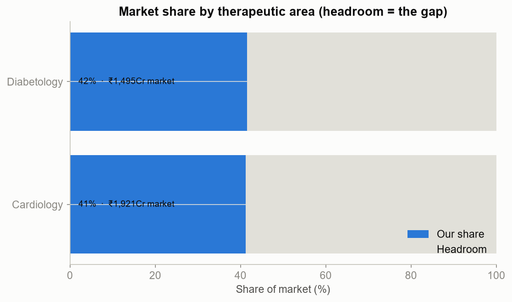
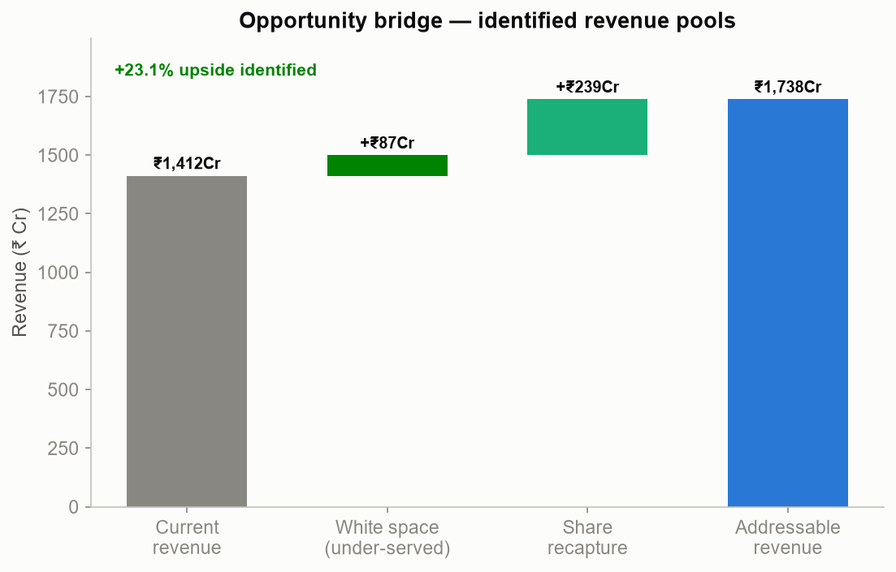
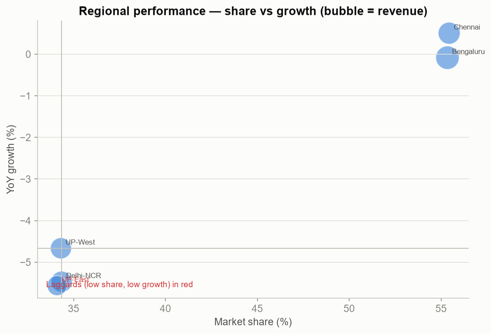
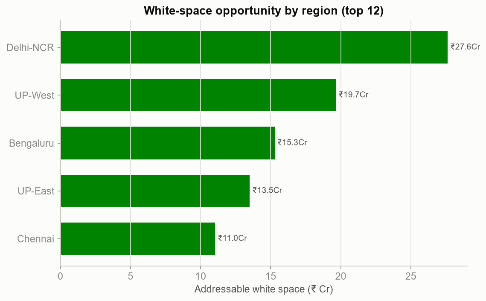
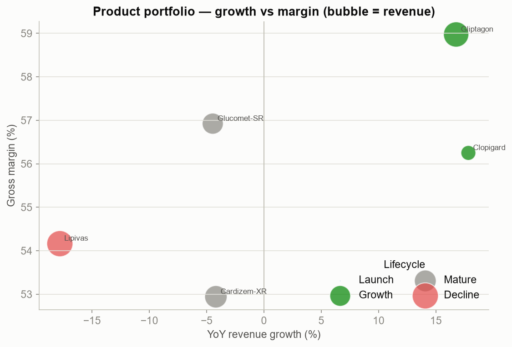
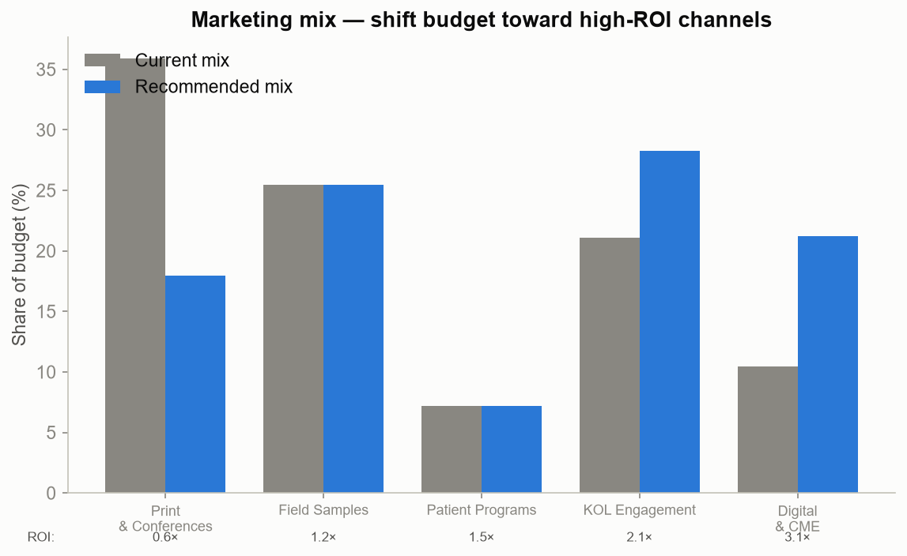

# Project Catalyst — Opportunity & Performance Diagnostics

**Reproducible** · seed=42 · TTM window · `scripts/run_performance.py`.

This milestone converts the diagnosis into **quantified opportunity** across four lenses —
market/Rx, region, product, and marketing — and produces the **opportunity register** the
financial model (M8) monetises.

## Headline — the opportunity register

| Lever | Type | Value (₹ Cr / yr) |
|-------|------|------------------:|
| White space (under-served doctors) | Revenue | 87 |
| Share recapture (pressured zones/TAs) | Revenue | 239 |
| Marketing reallocation (Print→Digital) | Margin | 56 |
| **Identified revenue opportunity** | | **326** (+23.1% of current) |

*(Pools are identified independently and may partially overlap; M8 reconciles them into conservative/base/aggressive scenarios.)*

---

## 1. Market & Rx opportunity (Module 8)

We hold meaningful headroom in every therapeutic area. In the **pressured zones/TAs** our
share is **34%** vs **55%** in the rest of the market;
recovering half that gap is worth **₹239 Cr**. Combined with the
under-served-doctor white space, the identified revenue pool is **₹326 Cr (+23.1%)**.

## 2. Regional performance (Module 10)

Performance is uneven: **1 regions** sit in the low-share / low-growth quadrant —
led by **UP-East** — yet several of these carry
the largest white space, confirming they are *under-served, not saturated*. These are the
priority regions for field re-alignment and marketing investment.

## 3. Product performance (Module 11)

The portfolio splits cleanly: growth brands (**Clopigard, +18%**)
sit in the attractive high-growth/high-margin space, while the declining hero
(**Lipivas, -18%**) drags the total. Promotional
support should follow margin-weighted growth, not legacy volume.

## 4. Marketing effectiveness (Module 12)

Re-weighting **50% of the Print & Conferences budget** toward Digital/CME and KOL lifts blended
efficiency materially — an estimated **₹56 Cr of incremental margin** at
flat total spend.

## Regional opportunity table (top 8 by white space)

| Region | Zone | TTM Rev | YoY | Share | White space |
|--------|------|--------:|----:|------:|------------:|
| Delhi-NCR | North | ₹269Cr | -5.5% | 34% | ₹27.6Cr |
| UP-West | North | ₹270Cr | -4.7% | 34% | ₹19.7Cr |
| Bengaluru | South | ₹341Cr | -0.1% | 55% | ₹15.3Cr |
| UP-East | North | ₹236Cr | -5.6% | 34% | ₹13.5Cr |
| Chennai | South | ₹297Cr | +0.5% | 55% | ₹11.0Cr |

---

## So what → the financial model

The three levers above are the inputs to Milestone 8: the **Commercial Opportunity Score**
(M6) prioritises *which* doctors/territories, the **optimization** (M7) sets *how much* effort
moves, and the **financial model** (M8) turns this register into ROI, NPV, payback, and
sensitivity/scenario ranges.
