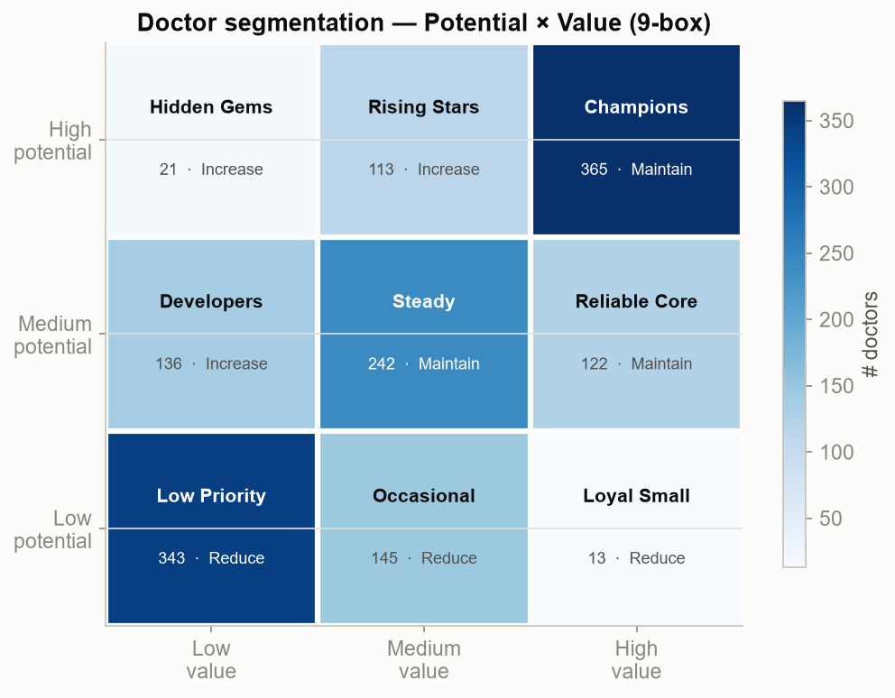
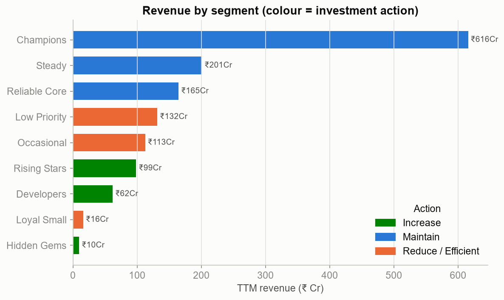
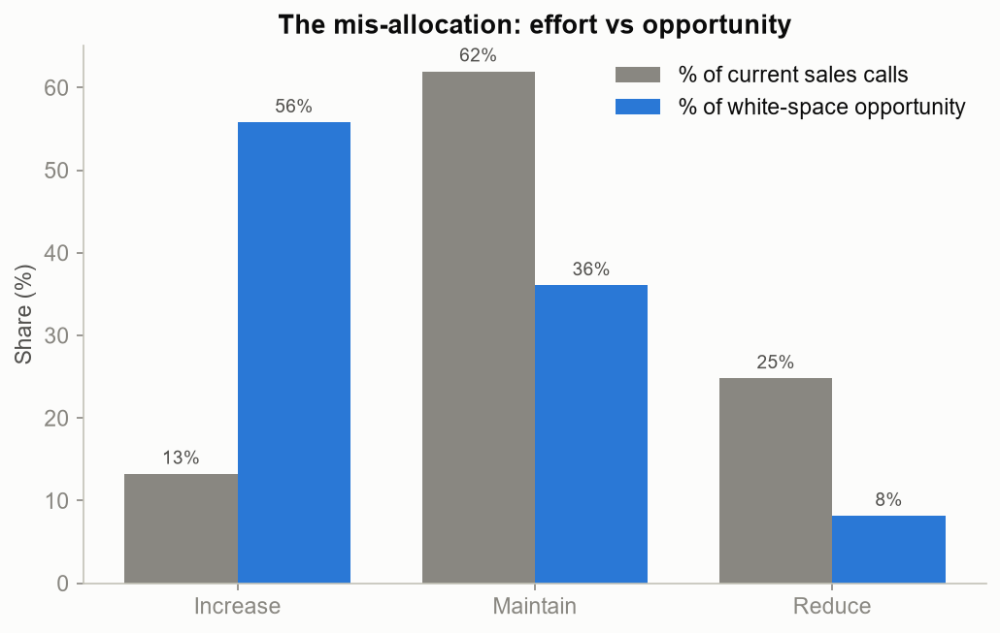
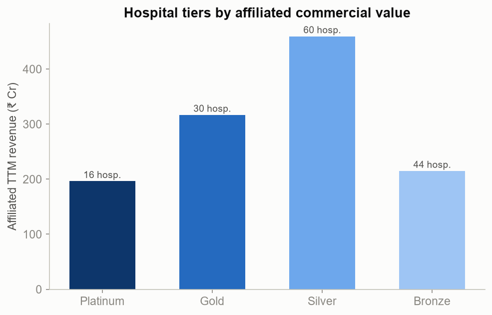

# Project Catalyst — Customer Segmentation

**Reproducible** · seed=42 · TTM window · regenerated by `scripts/run_segmentation.py`.

Segmentation converts the diagnostic into a **targeting decision**. Doctors are placed
on a **Potential × Value 9-box** framework; hospitals are tiered by potential. Each
segment carries an explicit field play (see below). Interpretable rules define the
segments; K-means only *validates* them.

## Headline

| Metric | Value |
|--------|------:|
| Total quantified white space | ₹ 87 Cr |
| White space in "Increase" segments | ₹ 49 Cr (56% of total) |
| "Hidden Gems" (high potential, low value) | 21 doctors |
| Segment validation (K-means vs rules, ARI) | 0.43 |

---

## 1. The 9-box: who our doctors are

The grid crosses **potential** (the ceiling) with **current value** (realised).
The decisive cell is **High potential / Low value — "Hidden Gems" (21 doctors)**:
genuine capacity we are not converting. Top-left of the value axis holds the
over-serviced, near-ceiling doctors.

## 2. Where the money is today

Revenue concentrates in the "Maintain" segments (already-loyal doctors). That is
fine to protect — but it is not where *growth* comes from.

## 3. The mis-allocation, in one chart

**"Increase" segments hold 56% of the white-space opportunity but receive only 13% of current calls.** Conversely, "Reduce/Efficient"
doctors — near their ceiling — absorb 25% of calls for just 8% of the
opportunity. This is the reallocation prize, made concrete.

## 4. Hospital tiers

Hospitals are tiered Platinum→Bronze by potential (scale + affiliated-doctor value).
Platinum/Gold accounts warrant key-account coverage; Bronze shifts to digital/low-touch.

---

## Segment summary & size

| Segment | Action | Doctors | % Docs | % Revenue | White space (₹Cr) |
|---------|--------|--------:|-------:|----------:|------------------:|
| Rising Stars | Increase | 113 | 7.5% | 7.0% | 23.7 |
| Developers | Increase | 136 | 9.1% | 4.4% | 17.8 |
| Hidden Gems | Increase | 21 | 1.4% | 0.7% | 7.1 |
| Champions | Maintain | 365 | 24.3% | 43.6% | 25.5 |
| Steady | Maintain | 242 | 16.1% | 14.2% | 5.9 |
| Reliable Core | Maintain | 122 | 8.1% | 11.7% | 0.0 |
| Low Priority | Reduce / Efficient | 343 | 22.9% | 9.3% | 7.1 |
| Occasional | Reduce / Efficient | 145 | 9.7% | 8.0% | 0.0 |
| Loyal Small | Reduce / Efficient | 13 | 0.9% | 1.1% | 0.0 |

## Field playbooks (the "so what")

| Segment | Action | Objective | Cadence | Channels | KPI |
|---------|--------|-----------|---------|----------|-----|
| Champions | Maintain | Protect the franchise; deepen breadth across the portfolio. | Sustain frequency; senior-rep / KOL engagement. | Field + KOL + CME | Share of prescriptions; portfolio breadth |
| Rising Stars | Increase | Accelerate conversion — genuine headroom above current value. | Increase call frequency; structured detailing. | Field + Digital + Samples | Rx growth %; new-brand adoption |
| Hidden Gems | Increase | THE white space — high potential, under-developed. Convert. | Materially increase coverage & frequency. | Field + Samples + Patient programs | First Rx; call-to-Rx conversion |
| Reliable Core | Maintain | Retain dependable volume; watch for competitor switching. | Maintain steady frequency. | Field + Digital | Retention; share stability |
| Steady | Maintain | Hold and nudge; opportunistic up-sell of growth brands. | Standard frequency. | Field + Digital | Rx growth % |
| Developers | Increase | Selectively develop where response is evident. | Test-and-learn frequency increase. | Digital + Samples + selective field | Call-to-Rx conversion |
| Loyal Small | Reduce / Efficient | Efficient retention — high value but near ceiling; avoid over-servicing. | Reduce field calls; shift to lower-cost touch. | Digital + periodic field | Cost-to-serve; retention |
| Occasional | Reduce / Efficient | Low-cost maintenance; limited upside. | Minimal field; digital-led. | Digital | Cost per Rx |
| Low Priority | Reduce / Efficient | Monitor only; free capacity for higher-opportunity doctors. | Digital-only / no active field. | Digital | Cost avoidance |

### Hospital tier plays
| Tier | Action | Objective |
|------|--------|-----------|
| Platinum | Strategic invest | Key-account plan; dedicated senior coverage; formulary access. |
| Gold | Invest | Structured coverage of affiliated high-potential doctors. |
| Silver | Maintain | Efficient coverage; grow selectively. |
| Bronze | Monitor | Low-touch / digital; monitor for emerging potential. |

---

## Validation (ML confirms, does not define)

A K-means (k=4) on [potential, value] reproduces the rule-based quadrants with
**Adjusted Rand Index 0.43** and silhouette **0.38** — the
interpretable segmentation is supported by the data's natural structure, while
remaining fully explainable to a sales VP.

**Next (M5–M6):** size each segment's opportunity per product and territory, and
fold potential + realisation + accessibility into a single **Commercial Opportunity
Score** to rank every doctor for the field.
